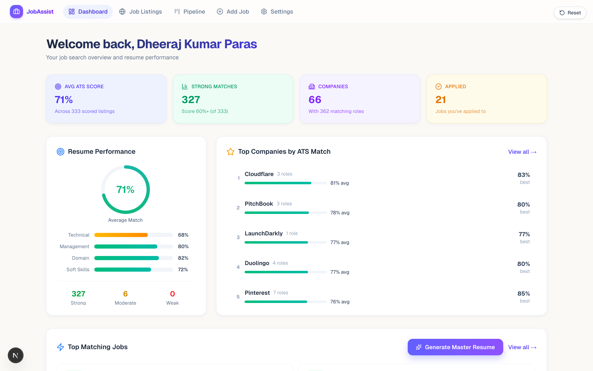
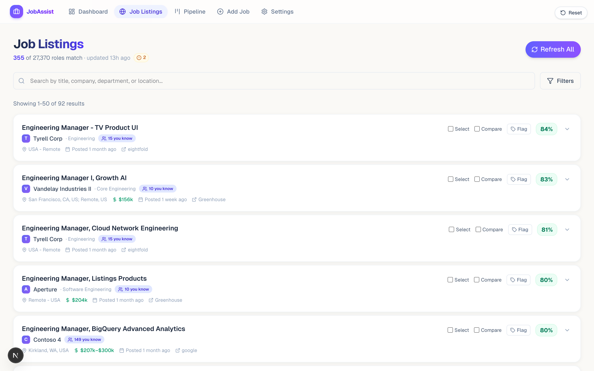
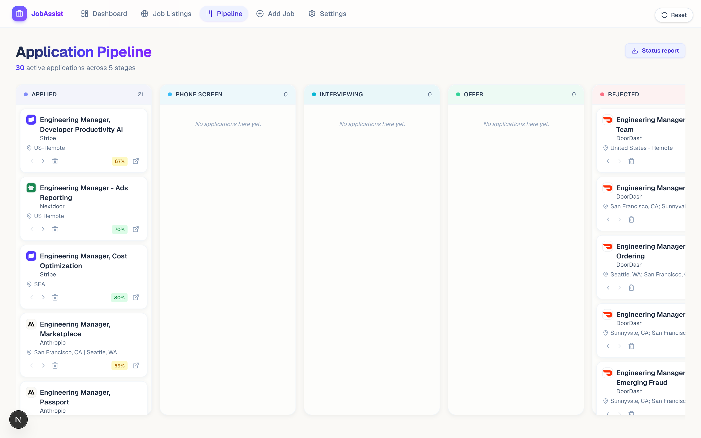
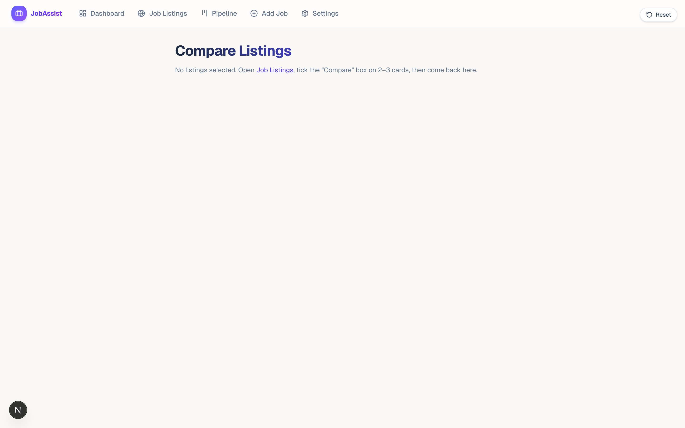
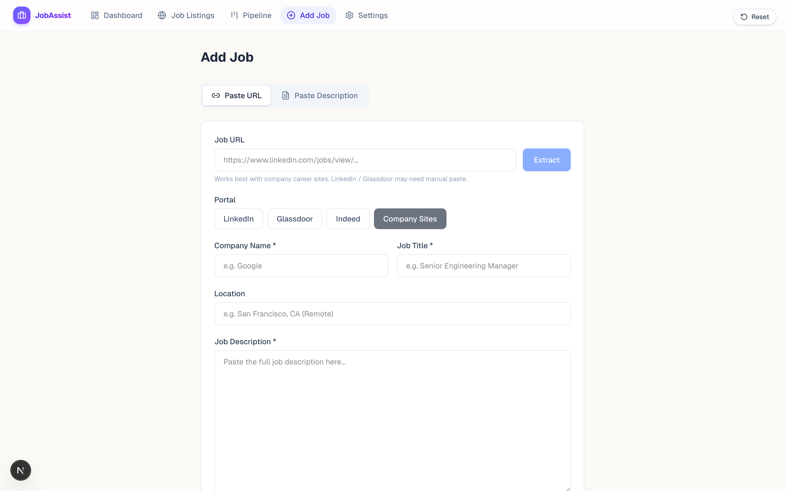
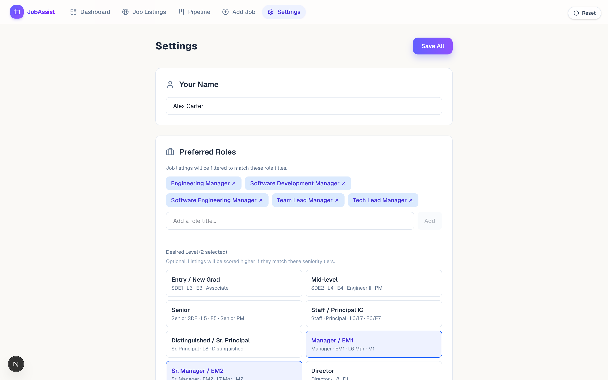

# Job Application Assistant

A local-first web app that pulls live job listings from 70+ tech-company career boards, scores your resume against each one, generates one-page tailored PDFs, and tracks your pipeline from "interesting" to "offer" — running entirely on your laptop.

> No SaaS account, no API key, no remote server. Next.js 16 + a JSON file under `data/` is the whole stack.



## What it does

### 📊 Dashboard — your job-search at a glance
- Average ATS match score across every scored listing, category breakdown (technical / management / domain / soft), tiered match counts (Strong / Moderate / Weak), pipeline applied-count.
- **Top Companies by ATS Match** — ranked list of companies where your resume scores highest.
- **Top Matching Jobs** — your best-fit individual roles, sorted by score.
- **Generate Master Resume** — one button that builds a single resume tuned for broad ATS coverage across every listing matching your stored preferences (more below).
- After uploading a new resume, a violet **Rescore listings** banner surfaces — one click batch-rescores everything against the new resume.



### 🔎 Job listings — live aggregation from 70+ sources
- Pulls openings from **Greenhouse**, **Lever**, **Ashby**, **Workday**, **Eightfold**, **SmartRecruiters** + company-specific APIs (Apple, Amazon, Google, Microsoft, Meta, Uber, …).
- **Custom sources UI** — add any company's careers board at runtime by pasting the URL; the app auto-detects the ATS.
- **Streaming refresh** — Server-Sent-Events progress bar fetches per-company in the background while you keep browsing.
- **Smart filters** — Role family, level (EM1 → VP), location, work mode, salary range, ATS score range, work-auth countries, excluded companies, date-posted.
- **Synonym-aware location matching** — recognizes `US`/`USA`/`U.S.`/`United States`, airport codes (`SEA`, `SFO`, `NYC`, `LAX`), state code ↔ name conversions. "Seattle, WA" + Remote catches `"US-SEA"`, `"USA - Remote"`, `"Remote - All locations"`.
- **Saved filter presets** — name and persist your favorite filter combinations.

### 🎯 ATS keyword scoring
- TF-weighted scorer with **JD-bigram phrase coverage** so multi-word matches like "distributed systems" or "incident response" actually count.
- Per-listing breakdown: technical / management / domain / soft + phrase coverage.
- **Auto-invalidates on resume upload** — cached scores wipe when you upload a new resume, then a one-click Rescore banner batch-refreshes everything.

### 💰 Salary intelligence
- **JD-only extraction** — no Levels.fyi / Glassdoor scraping. Pay-transparency laws (WA / CA / CO / NY / MA / IL) mean most US tech listings carry an explicit range, and the parser detects:
  - Explicit **Base + Total Comp splits** (`"Base salary: $X – $Y. Total compensation: $A – $B."` → both ranges stored)
  - **OTE** for sales roles → classified as TC
  - **Hourly rates** (`$X/hr`) → normalized to annual via × 2080
  - **Equity / RSU / stock-option mentions** as free-form hints
- **Peer-cohort statistics** (`p25 / median / p75`) derived from your own listings cache.
- **Backfill** in one click via Settings → Salary Data Backfill.

### ✍️ Resume tailoring — keep every keyword, fit on one page
- **Per-job tailor** — Inject every keyword you select against a specific listing. The compression cascade (margins → spacing → line-height → font shrink → drop ADDITIONAL section) keeps the PDF on one page. Floors at 9pt body and 0.4" margins. **Nothing is dropped** from your resume content.
- **Master Resume** — One Dashboard button. Stratified-samples up to 100 listings matching your preferences across role families, aggregates missing keywords, auto-picks the top 30 by frequency, lets you review/de-select, then runs the same cascade.
- **Smart text replacement** — when a suggestion proposes "Software Engineering Manager" instead of your existing "Software Development Manager", the app rewrites the phrase across every formatting boundary in your `.docx`.



### 📋 Application pipeline (Kanban)
- Five-column board: **Applied → Phone Screen → Interviewing → Offer → Rejected**. Move-left / move-right arrows on each card.
- One-click **Status report** export — Markdown summary of every active application, suitable for sharing with a mentor / coach.

### ✉️ Cover letters, outreach emails, interview prep
- **Deterministic cover-letter generator** — pulls years-of-experience, current employer, team scale, top quantified achievement from your resume + the JD's mission sentence + matched JD keywords → 3-paragraph draft. Edit inline, download as `.txt`.
- **Outreach email generator** — short recruiter-style notes leveraging the same signals.
- **Interview prep packets** — JD-keyed talking points, likely questions, "things to ask" lists.

### 🤝 LinkedIn network awareness
- Import your `Connections.csv` (or the raw `.zip` LinkedIn emails — we unzip server-side). Multi-file uploads supported.
- Listing cards show a clickable **"N you know"** badge when your network has contacts at that company. Click to expand a popover with names, positions, and LinkedIn profile links.
- All data stays local.



### ⚖️ Compare view
- Side-by-side comparison of 2–3 listings (work mode, salary range, posted date, ATS score with category breakdown).
- **Same-company callout** when all selected listings share an employer — flags that you're comparing roles, not companies.



### ➕ Add Job — capture postings outside the auto-sync
- Paste a job posting URL → the extractor uses Readability + per-ATS heuristics to pull title, company, location, JD.
- Or paste raw JD text directly. Either way it's scored against your resume immediately.
- **Browser extension** (see [extension/](extension/)) adds a floating **Save to JobAssist** button on LinkedIn / Indeed / Greenhouse / Lever / Ashby / Workday / SmartRecruiters / Glassdoor job pages — one click captures the current URL into your local tracker, no copy/paste.



### ⚙️ Settings
- Drag-and-drop resume upload (`.docx` preferred — required for tailoring; `.pdf` works for scoring only).
- Role / level / location / salary / work-mode / work-auth preferences.
- Custom Sources panel — add any career board.
- LinkedIn Network panel — multi-file zip / csv upload.
- Salary Data Backfill — one-click re-run of the salary parser across every cached listing.

## Setup

### 1. Prerequisites

| Tool | Version | Purpose |
| --- | --- | --- |
| **Node.js** | 20+ | Runs the Next.js app and server-side scrapers |
| **LibreOffice** | 7.x or 26.x | Renders the edited `.docx` to PDF for resume tailoring (`soffice --headless`) |
| **Git** | any recent | Cloning the repo |

Install on macOS:
```bash
brew install node
brew install --cask libreoffice
```

Install on Linux (Debian/Ubuntu):
```bash
curl -fsSL https://deb.nodesource.com/setup_20.x | sudo -E bash -
sudo apt-get install -y nodejs libreoffice
```

Install on Windows: [Node.js LTS](https://nodejs.org/) and [LibreOffice](https://www.libreoffice.org/download/download/). Make sure `soffice.exe` is on your PATH (usually `C:\Program Files\LibreOffice\program`).

Verify:
```bash
node --version       # ≥ v20
soffice --version    # LibreOffice 7.x or 26.x
```

### 2. Clone and install

```bash
git clone https://github.com/dheerajkp10/job-app-assistant.git
cd job-app-assistant
npm install
```

The first `npm install` takes a couple of minutes — Puppeteer downloads its own Chromium for the Apple/Meta scrapers. Subsequent installs are fast.

### 3. Run the dev server

```bash
npm run dev
```

Open <http://localhost:3000> in your browser.

### 4. Complete the 6-step onboarding wizard

On first visit you'll be walked through:

1. **Role & Level** — job families and seniority tiers
2. **Location** — preferred cities, work mode (remote / hybrid / onsite), work-auth countries
3. **Salary** — total comp range (optional)
4. **Resume** — drag-and-drop a `.docx` (preferred) or `.pdf`
5. **Companies** — preview of the career boards we'll scan
6. **Fetch Jobs** — kicks off a live SSE-driven fetch across every source (~30–90s)

When that finishes you land on Job Listings with live data.

### Health check

```bash
curl http://localhost:3000/api/health
# → {"libreoffice":{"ok":true,"version":"..."},"platform":"darwin"}
```

The app also surfaces a banner on every page if `soffice` is missing from your PATH.

## Day-to-day workflow

1. **Refresh listings** (`Listings → Refresh All`) — pulls latest postings across every source.
2. **Filter** to roles you'd apply to; save the filter set as a named preset for reuse.
3. **Browse + flag** — open listings, hit per-card **Tailor My Resume**, use the flag dropdown to mark pipeline state (Applied / Phone Screen / …).
4. **Generate Master Resume** from the Dashboard once you have 50+ matching listings. Download → re-upload as your new base via Settings.
5. **Rescore** — after uploading, click the violet **Rescore listings** banner on the Dashboard. Dashboard averages update with the new resume's score.
6. **Track pipeline** on `/pipeline`; export a Markdown **Status report** when sharing with a coach.
7. **Cover letter + outreach** on demand from any listing's detail view.

## Where your data lives

Everything is under `./data/` (gitignored):

```
data/
├── db.json                # Settings, listings cache, scoreCache, listing flags,
│                          # reminders, LinkedIn network, custom sources
├── resume/                # Uploaded resume(s)
├── listing-details/       # Cached JD HTML per listing
└── tailored/              # Generated tailored PDFs
```

Delete `./data/` to reset the app to a fresh-install state. No remote backend ever sees this data.

## Updating

```bash
git pull
npm install        # picks up any new deps
npm run dev
```

The app self-migrates its DB schema on first read — work-auth countries, scorer version, pipeline flag values, salary breakdown fields, etc. all auto-fill so older `data/db.json` files keep working.

## Production build (optional)

```bash
npm run build
npm run start      # serves on http://localhost:3000
```

The dev server (`npm run dev`) is plenty for personal use and gives you hot reload.

## Architecture

Next.js 16 (App Router) with React 19 and Tailwind. JSON file as the database. All scoring + tailoring runs in-process. LibreOffice is shelled out for docx → PDF conversion. Puppeteer (auto-installed) handles a handful of company scrapers (Apple, Meta) that don't have JSON APIs.

Key files:
- `src/app/` — pages + API routes
- `src/lib/sources.ts` — registry of career boards
- `src/lib/job-fetcher.ts` + `custom-fetchers.ts` — per-ATS list/detail fetchers
- `src/lib/ats-scorer.ts` — keyword scoring + JD-bigram phrase coverage
- `src/lib/salary-parser.ts` — Base + TC + hourly + equity extraction from JD text
- `src/lib/docx-editor.ts` — Word XML edits + compression cascade for one-page fit
- `src/lib/location-match.ts` — synonym-aware location matcher

## Troubleshooting

**LibreOffice timeout when downloading a tailored PDF.** First conversion warms up LibreOffice's font cache (10–15s); subsequent ones are < 2s. If a render hangs > 30s:
```bash
pkill -f soffice
```

**Apple / Amazon / Meta listings can't be scored.** Some career APIs don't expose per-job detail endpoints — the app marks them "unscorable" and skips them silently. Apple uses Puppeteer; if its Chromium failed to download:
```bash
npx puppeteer browsers install chrome
```

**Dashboard shows my old ATS score after uploading a new resume.** The score cache wipes on resume upload, but the Dashboard surfaces a violet **Rescore listings** banner — click it to batch-rescore every scorable listing against the new resume.

**Resume tailoring overflows to 2 pages.** Mandatory mode injects every selected keyword and compresses layout (margins → spacing → line-height → font) until 1-page fit. If your base resume is already maxed out and even max compression overflows, you'll see an amber "Couldn't fit on 1 page" footer; trim a bullet in your `.docx` and re-upload, or deselect a few low-frequency keywords.

**Some companies show 0 jobs.** Board tokens occasionally rotate. Open `src/lib/sources.ts` and try alternate slugs, or add the company as a Custom Source from Settings.

**State seems stale after edits.** Settings and listings cache are server-side. Reload the browser tab; the listings + pipeline pages also auto-revalidate on tab focus.

## Refreshing screenshots

The screenshots in this README are captured against your live dev server. To regenerate them after UI changes:

```bash
npm run dev                              # in one terminal
node scripts/take-screenshots.mjs        # in another
```

Output lands in `docs/screenshots/`. Captured at 1440×900 @ 2x scale.

## Contributing

PRs welcome — especially new career sources. To add one:
1. Probe the company's career page for its ATS (most use Greenhouse / Lever / Ashby / Workday / Eightfold / SmartRecruiters).
2. Add an entry to `src/lib/sources.ts` with the verified board token, or use the **Custom Sources** UI in Settings to add it at runtime.
3. Run the app, hit "Refresh All", verify listings show up.
4. If the source has a per-job detail endpoint, wire it into `fetchJobDetail()` so the listing becomes scoreable.
